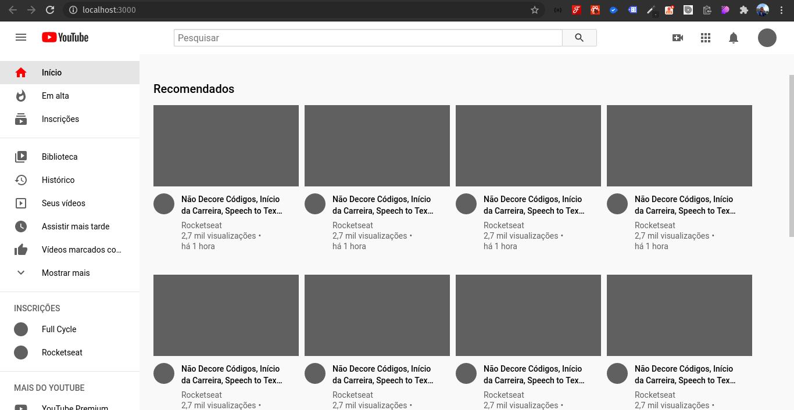

<h1 align="center">
  
</h1>

<p align="center">
  

  

  <a href="https://www.linkedin.com/in/lucasdeveloperti/">
    
  </a>

  <a href="https://github.com/lucas-eduardo/youtube-clone/commits/master">
    
  </a>

  

   <a href="https://github.com/lucas-eduardo/youtube-clone/stargazers">
    
  </a>
</p>

## 💻 Sobre o clone

O clone da aplicação do youtube foi desenvolvimento apenas para fins de estudos e de desafio próprio.

Link: https://uicloneyoutube.netlify.app/

---

## 🎨 Clone final

<div align="center">
  
</div>

---

## 🛠 Tecnologia

Foi utilizado o [ReactJS][reactjs] utilizando o CRA [TypeScript][typescript].

#### Pré-requisitos

Antes de começar, você vai precisar ter instalado em sua máquina as seguintes ferramentas:
[Git](https://git-scm.com), [Node.js][nodejs] e [Yarn][yarn].
Além disto é bom ter um editor para trabalhar com o código como [VSCode][vscode]

### 🧭 Rodando a aplicação

```bash
# Clone este repositório
$ git clone https://github.com/lucas-eduardo/youtube-clone

# Acesse a pasta do projeto no seu terminal/cmd
$ cd youtube-clone

# Instale as dependências
$ yarn install

# Execute a aplicação em modo de desenvolvimento
$ yarn start

# A aplicação será aberta na porta:3000 - acesse http://localhost:3000
```

[nodejs]: https://nodejs.org/
[typescript]: https://www.typescriptlang.org/
[expo]: https://expo.io/
[reactjs]: https://reactjs.org
[rn]: https://facebook.github.io/react-native/
[yarn]: https://yarnpkg.com/
[vscode]: https://code.visualstudio.com/
[license]: https://opensource.org/licenses/MIT
[rc]: https://rocketseat.com.br
